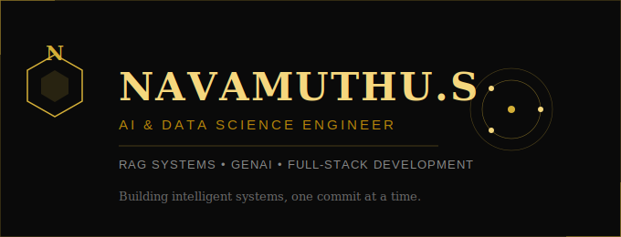

<div align="center">



<br/><br/>


<br/>


</div>

<br/>

<table align="center">
<tr>
<td width="50%" valign="top">

### About

```
class Navamuthu {
  role      = "AI & Data Science Engineer";
  year      = "3rd Year @ RVCE";
  focus     = ["RAG Systems", "LLMs", "Full-Stack Dev"];
  currently = "Building MediAssist AI";
}
```

</td>
<td width="50%" valign="top">

### Currently

- Working on: MediAssist AI — RAG-powered medical assistant
- Learning: Machine Learning (NPTEL) + AWS Cloud Practitioner
- Open to: Freelance projects & collaboration
- Reach me: navamuthu2007@gmail.com

</td>
</tr>
</table>

<br/>

<div align="center">

### Tech Arsenal


</div>

<br/>

<div align="center">

### Contribution Snake


</div>

<br/>

<div align="center">

### GitHub Analytics


</div>

<br/>

<div align="center">

### Connect

<a href="https://www.linkedin.com/in/navamuthus" target="_blank"></a>
<a href="mailto:navamuthu2007@gmail.com"></a>
<a href="https://wa.me/919884987918" target="_blank"></a>
<a href="https://navamuthus.github.io/My_Protfolio" target="_blank"></a>

<br/><br/>

<i>Building intelligent systems, one commit at a time.</i>

</div>
